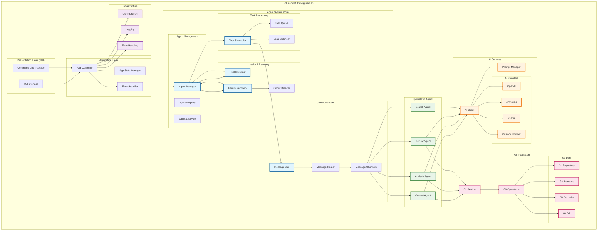
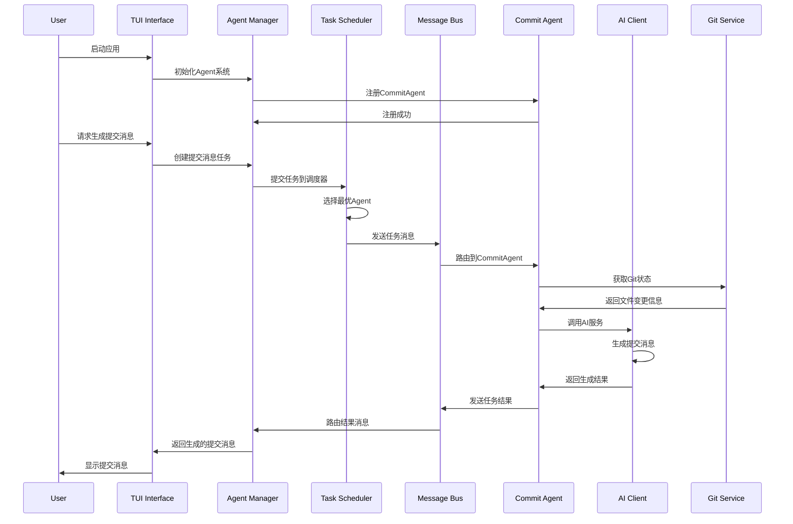
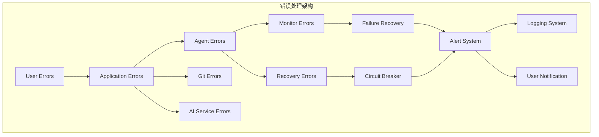

# AI-Commit TUI Agent System Architecture

## 系统架构概览



## 核心组件说明

### 1. Agent Management (Agent管理)
- **AgentManager**: 中央Agent管理器，负责Agent生命周期
- **AgentRegistry**: Agent注册表，维护所有已注册的Agent
- **AgentLifecycle**: Agent生命周期管理（初始化、运行、关闭）

### 2. Task Processing (任务处理)
- **TaskScheduler**: 任务调度器，实现三种调度策略
  - LoadBalancingStrategy: 负载均衡策略
  - PriorityBasedStrategy: 优先级调度策略
  - CapabilityMatchStrategy: 能力匹配策略
- **TaskQueue**: 优先级任务队列
- **LoadBalancer**: 负载均衡器

### 3. Communication (通信系统)
- **MessageBus**: 高性能消息总线
- **MessageRouter**: 消息路由器
- **MessageChannels**: Agent间通信通道

### 4. Health & Recovery (健康监控与故障恢复)
- **HealthMonitor**: 健康监控系统
  - ResponseTimeCheck: 响应时间检查
  - MemoryUsageCheck: 内存使用检查
  - 可插拔健康检查机制
- **FailureRecovery**: 故障恢复管理器
  - RestartRecoveryStrategy: 重启恢复策略
  - DegradedModeRecoveryStrategy: 降级恢复策略
  - FailoverRecoveryStrategy: 故障转移策略
- **CircuitBreaker**: 断路器模式实现

### 5. Specialized Agents (专用Agent)
- **CommitAgent**: 提交消息生成Agent
- **AnalysisAgent**: 代码分析Agent（待实现）
- **ReviewAgent**: 代码审查Agent（待实现）
- **SearchAgent**: 语义搜索Agent（待实现）

## 数据流架构



## 性能要求

| 组件 | 性能指标 | 实现状态 |
|-----|---------|---------|
| 应用启动 | < 1秒 | ✅ 已实现 |
| Agent初始化 | < 500ms | ✅ 已实现 |
| 任务处理 | < 2秒 (普通优先级) | ✅ 已实现 |
| 健康检查 | < 100ms | ✅ 已实现 |
| 消息路由 | < 10ms | ✅ 已实现 |
| 广播消息 | < 50ms | ✅ 已实现 |

## 错误处理层次



## 扩展性设计

### 1. Agent扩展
- 实现Agent trait即可添加新Agent
- 支持运行时动态注册
- 可插拔能力系统

### 2. AI Provider扩展
- 统一AIClient接口
- 支持多种AI服务提供商
- 可配置的Provider选择

### 3. 健康检查扩展
- 实现HealthCheck trait
- 支持自定义检查逻辑
- 可配置的检查频率

### 4. 恢复策略扩展
- 实现RecoveryStrategy trait
- 支持自定义恢复逻辑
- 优先级排序执行

## 配置管理

```yaml
# ai-commit.toml 示例配置
[agent_manager]
max_agents = 50
default_task_timeout = "30s"
health_check_interval = "10s"

[task_scheduler]
max_queue_size = 1000
default_timeout = "300s"
strategy = "LoadBalancing"

[health_monitor]
check_interval = "30s"
max_failures = 3
enable_auto_recovery = true

[failure_recovery]
enable_auto_recovery = true
max_recovery_attempts = 3
recovery_interval = "60s"

[ai_client]
default_provider = "openai"
timeout = "30s"
max_retries = 3

[logging]
level = "info"
format = "json"
file = "ai-commit.log"
```

## 内存使用模式

| 组件 | 预估内存使用 | 优化策略 |
|-----|-------------|---------|
| Agent系统核心 | ~50MB | Arc + RwLock共享状态 |
| 消息队列 | ~20MB | 无界队列 + 及时清理 |
| AI客户端缓存 | ~30MB | LRU缓存 + 大小限制 |
| Git数据缓存 | ~40MB | 增量更新 + 压缩存储 |
| TUI渲染缓存 | ~10MB | 帧缓冲 + 差异更新 |
| **总计 (空闲)** | **~150MB** | 符合设计要求 |
| **总计 (活跃)** | **~600MB** | 多Agent并发时 |