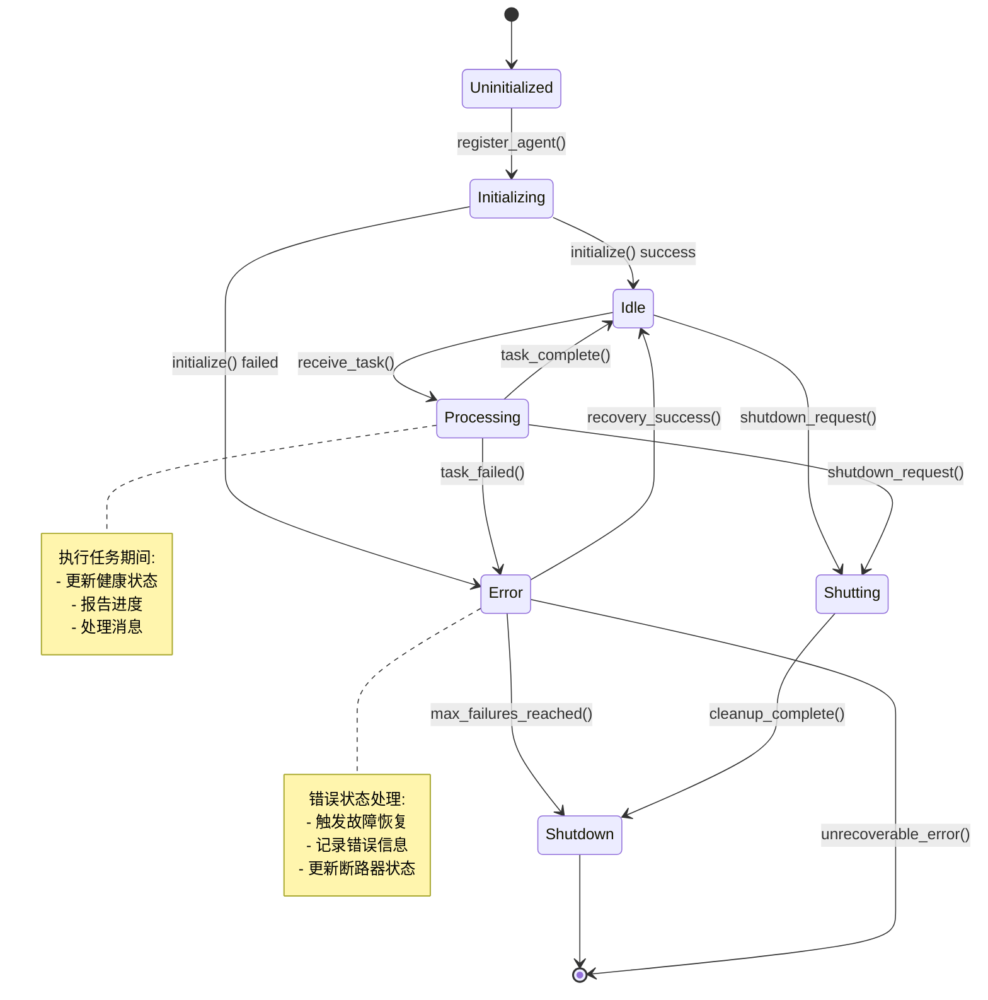

# AI-Commit Agent System Workflows

## 1. Agent生命周期管理流程

## 2. 任务调度与执行流程

## 3. 健康监控与故障恢复流程

## 4. 消息总线通信流程

## 5. AI服务集成流程

## 6. Git集成与分析流程

## 7. 完整的提交消息生成流程

## 性能指标与监控点

### 关键性能指标 (KPIs)

| 指标 | 目标值 | 监控方法 | 告警阈值 |
|-----|--------|---------|---------|
| 应用启动时间 | < 1秒 | 启动计时器 | > 2秒 |
| Agent初始化时间 | < 500ms | Agent生命周期计时 | > 1秒 |
| 任务调度延迟 | < 10ms | 任务队列监控 | > 50ms |
| 消息路由延迟 | < 10ms | 消息总线统计 | > 20ms |
| 健康检查响应 | < 100ms | 健康监控计时 | > 200ms |
| AI服务响应时间 | < 5秒 | AI客户端统计 | > 10秒 |
| 内存使用率 | < 80% | 系统监控 | > 90% |
| 任务成功率 | > 95% | 任务执行统计 | < 90% |

### 监控数据收集点

这个架构文档提供了AI-Commit Agent系统的完整视图，包括系统架构、数据流、错误处理、性能监控等各个方面的详细设计。